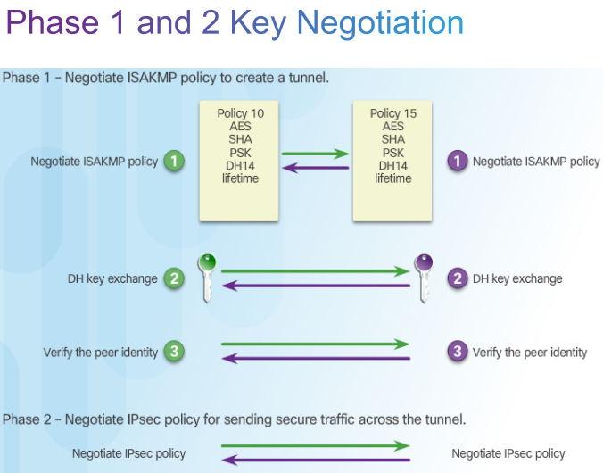

# IPsec (IP Security Architecture) 

- [Transport vs tunnel models ](#Transport-vs-tunnel-models)
  * [IKEv1](#IKEv1)
  * [Phase 1 ja 2](#Phase-1-ja-2)
- [reitittimen komennot ja konffaus](#reitittimen-komennot-ja-konffaus)
  * [tarkista määritykset](#tarkista-määritykset)
  * [reitittimen versio](#reitittimen-versio)
- [IPsec tutoriaalit ja muut guide asiat](#IPsec-tutoriaalit-ja-muut-guide-asiat)

TCP/IP-joukkon kuuluva tietoliikenneprotokolla Internet-yhteyksien turvaaminen. Nämä protokollat tarjoavat salauksen, osapuolten todennuksen ja tiedon eheyden varmistamisen. Pääasiassa tämä tarkoittaa UDP-pohjaisia sovelluksia, ICMP-kontrolliviestejä sekä reitityksessä ja tunneloinnissa käytettyjä IP-protokollia kuten GRE:tä, OSPF:aa ja niin edelleen. Verrattaessa kuljetuskerroksen protokolliin (4.layer OSI-malli), kuten SSLään, haittapuolena on se, että IPsec-protokollien pitää pystyä hallitsemaan myös vakaus- ja fragmentoitumisongelmat, jotka yleensä on hoidettu korkeammalla tasolla, TCP- eli kuljetuskerroksella.

Käytössä protokolla voi käyttää vaihtoehtoisia kuten:
- yhteydenpitokanavien turvaamista, jolloin usieden koneiden isäntä tai jopa koko lähiverkon liikenne ohjataan yhden pisteiden (esim. palomuurien) kautta, jossa lähtevän liikenne salataan ja vastaavasti paluulikenne puretan tai
- pakettiliikenteen turvaamiseen koko matkalle lähettäjältä vastaanottajalle, jolloin päätepisteiden tietokoneet hoitavat salauksen vaatiman prosessoinnin.

IPsec-protokollaa voidaan käyttää VPN-ratkaisun eli näennäisen yksityisverkon rakentamiseen kummallakin tavalla. On huomioitava että saavutettava tietoturva eroaa huomattavasti näiden kahden mallin välillä.

  

IPSEC protokollat:  
(AH) authentication header  
IP protocol 51 ei siällä tietojen luottamuksellisuutta. Se ei salaa tietoja ollenkaan. AH tarjoaa sekä todennus- että eheyspalvelua.  AH ei suorita salausta, se on nopeampi standardi kui ESP

(ESP) Encapsulation security payload:  
IP protocol 50 suorittaa luottamuksellista-, todennusta, ja eheyspalvelua. ESP suorittaa salausta ja on luonnostaan turvallisempi kuin AH. ESP esittelee sekä ylätunnisteen, että perävaunun pakettiin.

Policy ID saa olla eri toisistaan, mutta konffauksen algoritmit, aes, ja muut jotakin tiettyjen ominaisuudet pitää olla identtisiä toisistaan
  

  

## IKEv1
Internet Key Exchange - versioita on kaksi tyypistä nimellä IKEv1 tai IKEv2

## Phase 1 ja 2

- ISAKMP (Internet Security Association and Key Management Protocol)
- AES (Advanced Encryption Standard) Encryption Algorithm
- SHA (Secure Hash Algorithm) Cryptographic hash function
- PSK (Pre-Shared Key)
- DH (Diffie-Hellman) Method of securely exchanging cryptographic keys over a public channel

VPN tunnelin rakentamiseksi IPsec vertaisyritykset vaihtavat joukon viestejä salauksesta ja todennusta ja yrittävät sopia monista erilaisista parametristä, siks tätä kutsutaan VPN-neuvottelut (negotiation). Tämä sekvensi laite on kuin herätin ja toisessa vastapäässä on vastaaja.

Neuvoteltussa suoriuttuu kahden erillisen vaihdeen (Phase 1 ja 2). 
- Phase 1: tarkoituksena on perusta suojattun ja salatun kanavan, jonka kautta phase 2 vertaistaa/neuvotella toisensa yhteytä. Kun phase 1 on konfattu onnistuneesti niin kumppani siirtyvät nopeasti phase 2:lle neuvotteluun. Mikäli jos phase 1 vaihe konffaukset epäonnistuu niin laitteet eivät voi kommunikoida toisensa.

- Phase 2: neuvotellussa sen tarkoituksena on, että kahden vertaisen eli phase 1 ja 2:sen sopivia parameterjä, jotka määrittelevät toisensa, että liikennettä voi kulkea VPN:n kautta ja kuinka liikenne salataan ja todennetaan, siksi tätä kutsutaan turvallisuuden yhdistämiseksi (security association)

Phase 1 ja 2 kokoonpanoja on vastattava tunnelin kummasssakin päässä olevista laitteesta, että suoriutuvat kuin peili mukaisena konffauksena.

## Transport vs tunnel models 
Transport vs tunnel models molempien protokollassa (AH & ESP), voi operoida kahta modeemia  

- Transport moodi - aluperäisen IP-otsikon jätetään ehjiksi. Käytetään suojaamaan tiedonsirtoa yhdellä laitteella toiselle laitteelle. 

- Tunnel moodi - koko alkuperäisen pakettin hajautettua ja/tai salattua, mukaanlukien sekä hyötykuorma, että mahdolliset alkuperäiset otsikot. Väliaikaisen IP-otsikkoa lisätään pakettiin siirron aikana. Käytettään tunnelin liikenteelle paikasta toiseen.

# reitittimen komennot ja konffaus

## tarkista määritykset

| komennot | kuvaus |
| ----- | ---------- |
| $show crypto ipsec transform-set  | | 
| $show crypto isakmp sa  | varmistaa, että ISAKMP-tunneli on konfiguroitu/olemassa/luotu | 
| $show crypto ipsec sa   | varmistaa, että IPsec-tunneli on konfiguroitu/olemassa/luotu | 
| $show crypto map  | varmistaa crypto map on konfiguroitu, että IPV4 reititys reititimestä, ipsec-isakmp id, BGP reititys eli tietojen vaihtamista. | 

## reitittimen versio  
tarkista routerin security määritys "$show version"  

jos puuttuu voidaan määrittää sen securityk9:ksi mikä tais olla oletus nimi. Jokaisen routeri määrityksessä on oma "cLuku"
  
"license boot module c1900 technology-package securityk9"
  
jokaisessa routerissa on eriluku toi "c1900" kantsii tarkistaa
  
jos mielestäsi on oikea valikko sit vaan "yes"
muist tallentaa "$copy run start" tai "write" / "wr"
  
käynnistä uudelleen "$reload" ja tarkista, että on määritetty securitety licenssi

# IPsec tutoriaalit ja muut guide asiat  

https://www.cisco.com/en/US/docs/routers/access/800/850/software/configuration/guide/vpngre.html  
https://www.firewall.cx/cisco-technical-knowledgebase/cisco-routers/867-cisco-router-site-to-site-ipsec-vpn.html  

https://kalaharijournals.com/resources/141-160/IJME_Vol7.1_159.pdf  
https://cybersecfaith.com/2020/11/01/setting-up-an-ipsec-vpn-using-cisco-packet-tracer/  
https://www.cisco.com/en/US/docs/routers/access/800/850/software/configuration/guide/vpngre.pdf   

